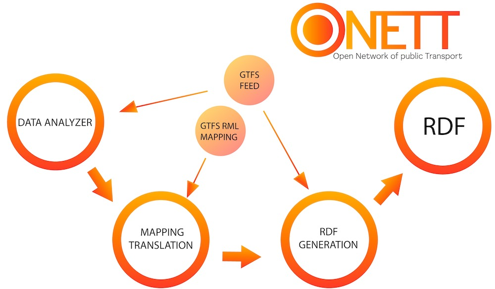

## The ONETT demo
{:#demonstration}

The [Open NEtwork of public Transport application (ONETT)](https://osoc-es.github.io/onett/) uses Semantic Web technologies to perform a knowledge graph generation in the transport domain. More in detail, ONETT applies the concept of [Ontology Based Data Access (OBDA)](cito:cites poggi2008linking), which it aims at providing a unified view and common access to a set of data sources, using ontologies and mappings.

In this specific case, we generate a [general mapping between GTFS](https://github.com/osoc-es/onett-back/blob/master/mapping/mapping/mapping.gtfs2trnasmodel.yml) and ontology based Transmodel using the RML specification in its [YARRRML](cito:cites Heyvaert2018Declarative) serialization. For transforming the raw data in CSV to RDF ONETT integrates the [SDM-RDFizer](https://github.com/SDM-TIB/SDM-RDFizer) engine for RML mappings. Before running the transformation, we have to perform a [mapping translation](cito:cites corcho2019towards) process to adapt the general mapping to the input data as it is not always going have the same structure and number of files. The workflow of the application is shown in . More in detail, the steps following by ONETT for generating the desirable RDF knowledge graph based on the Transmodel ontology from a GTFS feed are:

1. Analyse the input data: It decompresses and analyses the input GTFS feed to know the files and the structure of each file (headers).
2. Mapping translation: It takes the general GTFS YARRRML mapping that represents  the full specification and generates a new mapping corresponding to the input data.
3. Knowledge Graph Generation: It runs the SDM-RDFizer engine to transform the raw data to RDF.

<figure id="onett-workflow">

<figcaption markdown="block">
The ONETT workflow for the systematic generation of Knowledge Graph following Transmodel from GTFS feeds.
</figcaption>
</figure>

These steps are a black box for the transport authorities that want to obtain the knowledge graph from their GTFS feeds. Using the web application the user only has to upload the compressed feed or provide a URL and automatically ONETT generates the corresponding knowledge graph. With this approach, we provide a useful tool to generate National Access Point complaint data from a de-facto standard and very popular data format in a systematic manner.

